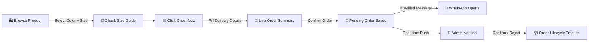

<div align="center">


<br/>

[](https://github.com/Nayeem131136/zyvro-official)
&nbsp;
[](https://vercel.com)
&nbsp;
[](https://supabase.com)
&nbsp;
[](https://react.dev)
&nbsp;
[](LICENSE)

<br/>


</div>

---

## 📖 About

**ZYVRO** is a premium Bangladeshi streetwear e-commerce storefront built around Oversized Drop Shoulder T-shirts. The site is a full **catalog + WhatsApp-order** experience — no payment gateway needed. Customers browse products, pick a color/size, and a professional order flow collects delivery details, shows a live order summary, then hands off to WhatsApp with a fully pre-filled message. An admin panel (Supabase-backed, real-time) manages products, size guides, and the full order lifecycle.

> *"Not for everyone. Built different."*

---

## ✨ Key Features

<div align="center">

| Feature | Description |
|---|---|
| 🛍️ **Dynamic Product Catalog** | Products, categories, colors, sizes & stock — all managed live from the admin panel |
| 💬 **3-Step WhatsApp Order Flow** | Customer info → live order summary → auto-generated WhatsApp message with full order details |
| 📏 **Dynamic Size Guide System** | Unlimited size guides per category, fully editable tables (not static images) |
| 🔔 **Real-Time Order Notifications** | New orders push instantly to the admin dashboard via Supabase real-time |
| 📦 **Full Order Management** | Pending → Confirmed → Printing → Packed → Shipped → Delivered, with timeline history |
| 🔐 **Admin-Only Auth** | Single gated admin login (Supabase Auth) — no public signup, RLS-enforced writes |
| 🖼️ **Auto Image Compression** | Uploads are resized & compressed client-side before hitting storage |
| 🎨 **Premium Dark/Gold UI** | Moody, editorial streetwear aesthetic with scroll-reveal micro-animations |

</div>

---

## 🛠️ Tech Stack

<div align="center">


</div>

---

## 🏗️ Project Structure

```
zyvro-official/
├── 🎨 src/
│   ├── routes/              # Home, Shop, Product, About, Contact, Admin, Admin Login
│   ├── components/          # ProductCard, Footer, Badges, reusable UI (shadcn-based)
│   ├── lib/                 # admin, products, orders, size-guides, settings, csv, sku
│   └── integrations/
│       └── supabase/        # client, server client, auth middleware, generated types
├── 🗄️ supabase/
│   └── migrations/          # Products, orders, size guides, RLS policies
├── vite.config.ts           # TanStack Start + Nitro (Vercel preset)
└── package.json
```

---

## 🔄 How It Works



---

## ⚙️ Installation & Setup

```bash
# 1. Clone the repository
git clone https://github.com/Nayeem131136/zyvro-official.git
cd zyvro-official

# 2. Install dependencies
npm install

# 3. Add your Supabase environment variables (create a .env file)
VITE_SUPABASE_URL=your_supabase_url
VITE_SUPABASE_PUBLISHABLE_KEY=your_supabase_anon_key
VITE_SUPABASE_PROJECT_ID=your_supabase_project_id

# 4. Run locally
npm run dev
```

---

## 🚀 Deploy Your Own

```bash
# Push to GitHub
git init
git add .
git commit -m "Initial commit: ZYVRO"
git branch -M main
git remote add origin https://github.com/Nayeem131136/zyvro-official.git
git push -u origin main
```

Then on **[vercel.com/new](https://vercel.com/new)**:
1. Import the `zyvro-official` repo
2. Add the three Supabase environment variables under Project Settings
3. Click **Deploy** 🚀

Every push to `main` auto-redeploys. The build targets Vercel's Nitro preset out of the box.

---

## 🧭 Usage

| Step | Action |
|---|---|
| 1️⃣ | Customer browses Shop, opens a product, checks the Size Guide |
| 2️⃣ | Selects Color + Size, clicks **Order Now** |
| 3️⃣ | Fills name, phone, district, area, address in the order popup |
| 4️⃣ | Reviews the live order summary (subtotal + delivery + total) |
| 5️⃣ | Confirms — order is saved as Pending and WhatsApp opens pre-filled |
| 6️⃣ | Admin sees a real-time notification, then Confirms or Rejects the order |

---

## 🗺️ Roadmap

- [ ] SSLCommerz / bKash / Nagad payment integration (once order volume scales)
- [ ] Customer order-status lookup by phone number
- [ ] Bulk discount / coupon code system
- [ ] Multi-admin roles (staff accounts with limited permissions)

---

## 👤 Developer

<div align="center">

| Name | Role | GitHub |
|---|---|---|
| **Md. Mahdi Hasan Nayeem** | 🏆 Creator & Developer | [@Nayeem131136](https://github.com/Nayeem131136) |

**Portfolio:** [mahdi-hasan-nayeem-portfolio.vercel.app](https://mahdi-hasan-nayeem-portfolio.vercel.app/)

</div>

---

<div align="center">


**⭐ Star this repo if it helped you! | 🍴 Fork to build your own**

[](https://github.com/Nayeem131136/zyvro-official/stargazers)
&nbsp;
[](https://github.com/Nayeem131136/zyvro-official/network/members)

*Built with 🖤 by Md. Mahdi Hasan Nayeem*

</div>
